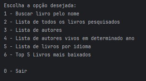

# LITERALURA 📚
Challenge de projeto proposto durante a formação de Java + Spring bot ofertado pelas instituições Alura + Oracle.

<h1>OBJETIVO👈</h1>

Essa aplicação usa a API Gutendex: <a>https://gutendex.com/</a> para realizar a busca de livros e autores, 
conforme o input do usuário e salva no banco de dados Postgres SQL

<h1>TECNOLOGIAS USADAS 🪄</h1> 
* Java 17 
* Postgres
* Spring Framework
* API Gutendex
